# CMMS API - Entity Relationship Diagram

## Overview
The CMMS (Computerized Maintenance Management System) API integrates multiple maintenance and asset management modules for naval ship operations.

---

## ER Diagram

```mermaid
erDiagram
    SHIP ||--o{ EQUIPMENT : contains
    SHIP ||--o{ DEFECT : reports
    SHIP ||--o{ SRAR_MONTHLY_HEADER : reports
    SHIP ||--o{ ABER : manages
    SHIP ||--o{ OPDEF : initiates
    SHIP ||--o{ REFIT_COMPLETION : undergoes
    
    EQUIPMENT ||--o{ EQUIPMENT_SPECIFICATION : has
    EQUIPMENT ||--o{ ROUTINE_DESCRIPTION : requires
    EQUIPMENT ||--o{ OPDEF : relates_to
    EQUIPMENT ||--o{ ABER : evaluated_in
    
    DEFECT ||--o{ DEFECT_RECTIFICATION : resolved_by
    DEFECT ||--o{ COMPLETED_ROUTINE : completed_via
    
    ROUTINE_DESCRIPTION ||--o{ COMPLETED_ROUTINE : tracks
    ROUTINE_DESCRIPTION ||--o{ FUSS_RAISE : scheduled_in
    ROUTINE_DESCRIPTION ||--o{ MAINTOP_JIC : details_in
    
    FUSS_RAISE ||--o{ MAINTOP_JIC : references
    FUSS_RAISE ||--o{ DEFERMENT : may_require
    FUSS_RAISE ||--o{ REASON : may_have
    FUSS_RAISE ||--o{ INABILITY : may_have
    
    MAINTOP_HEADER ||--o{ MAINTOP_DETAIL : contains
    MAINTOP_DETAIL ||--o{ MAINTOP_JIC : details_in
    MAINTOP_JIC ||--o{ JIC_SPARES : requires
    MAINTOP_JIC ||--o{ JIC_TOOLS : requires
    MAINTOP_JIC ||--o{ JIC_ATTACHMENTS : includes
    
    MAINTOP_HEADER ||--o{ MAINTOP_LIST_DIST : distributed_to
    MAINTOP_LIST_DIST ||--o{ DIST_ADDRESS : sent_to
    
    SRAR_MONTHLY_HEADER ||--o{ SRAR_EQUIPMENT_EXPLOITATION : contains
    SRAR_EQUIPMENT_EXPLOITATION ||--o{ SFD_DETAILS : exploits
    
    OPDEF_MAIN ||--o{ OPDEF_GENERATION_INFO : contains
    OPDEF_MAIN ||--o{ DEFECT_ANALYSIS : analyzes
    OPDEF_MAIN ||--o{ MAJOR_SPARE_CONSUMER : consumes
    OPDEF_MAIN ||--o{ TRIAL_CONDUCTED_PARAMETER : conducts
    OPDEF_MAIN ||--o{ OPDEF_PRIOR_PARAMETER : has_prior
    OPDEF_MAIN ||--o{ PHOTOGRAPH : documents
    
    ABER ||--o{ REPAIR_AGENCY : assigned_to
    ABER ||--o{ FITTED_EQUIPMENT : evaluates
    
    REFIT_COMPLETION ||--o{ REFIT_DELINQUENCY : records
    REFIT_COMPLETION ||--o{ DRY_DOCKING : performs
    REFIT_COMPLETION ||--o{ OCR : generates
    
    DEFECT ||--o{ SEVERITY_CODE : has_severity
    DEFECT ||--o{ SYMPTOM_CODE : has_symptom
    DEFECT ||--o{ REPAIR_AGENCY : assigned_to
    DEFECT ||--o{ DIAGNOSTIC_CODE : diagnosed_via
    DEFECT ||--o{ REPAIR_CODE : repaired_via
    DEFECT ||--o{ DELAY_CODE : delayed_by
    
    DEPARTMENT ||--o{ DEFECT : reports
    DEPARTMENT ||--o{ OPDEF : creates
    
    SPARE ||--o{ ILMS_DEMAND : tracked_by
    SPARE ||--o{ ILMS_PTS : tracked_by
    SPARE ||--o{ ILMS_SURVEY : surveyed_by
    SPARE ||--o{ WLMS_DEMAND : tracked_by
    SPARE ||--o{ WLMS_PTS : tracked_by
    SPARE ||--o{ WLMS_SURVEY : tracked_by
    
    ILMS_DEMAND ||--o{ ILMS_RECEIVE : received_via
    ILMS_RECEIVE ||--o{ ILMS_POST_RECEIVE : completed_by
    
    WLMS_EQUIPMENT ||--o{ WLMS_SPARE : contains
    WLMS_SPARE ||--o{ WLMS_DEMAND : tracked_by
    WLMS_DEMAND ||--o{ WLMS_RECEIVE : received_via
    
    TRIAL ||--o{ VIBRATION_TRIAL_X : measures
    TRIAL ||--o{ PRERANGING : prepares
    TRIAL ||--o{ BLOWING_ARC : executes
    TRIAL ||--o{ TRIAL_SUBMISSION : submits
    TRIAL_SUBMISSION ||--o{ TRIAL_APPROVAL : approved_via
    
    REFIT_CATEGORY ||--o{ REFIT_MAINTENANCE_PERIOD : defines
    REQUIRED_ASSISTANCE ||--o{ DEFECT : assists_for
    
    SECTION ||--o{ EQUIPMENT : categorizes
    GROUP ||--o{ EQUIPMENT : categorizes
    COMMAND ||--o{ SHIP : commands
    OPS_AUTHORITY ||--o{ SHIP : oversees
```

---

## Module Breakdown

### 1. **DART (Defect And Repair Tracking)**
- **Core Entities**: Defect, DefectRectification, CompletedRoutine
- **Master Data**: Severity Code, Symptom Code, Repair Code, Diagnostic Code, Delay Code
- **Key Relationships**: 
  - Defects are reported against Equipment on Ships
  - Defects are rectified by Repair Agencies
  - Rectification tracked via CompletedRoutine

### 2. **SRAR (Ship Readiness And Reliability)**
- **Core Entities**: SRARMonthlyHeader, SRAREquipmentExploitation
- **Key Relationships**:
  - Ships report monthly SRAR data
  - Equipment exploitation tracked for each month

### 3. **EMS (Equipment Management System)**
- **Core Entities**: FussRaise, RoutineDescription, MaintopHeader, MaintopDetail
- **Sub-entities**: MaintopJIC, JICSpares, JICTools, JICAttachments
- **Key Relationships**:
  - Routine descriptions trigger FUSS raises
  - MAINTOP documents procedures for routines
  - JIC (Job Instruction Cards) detail procedure steps with spares/tools

### 4. **SFD (Ship Fleet Database)**
- **Core Entities**: Ship, Equipment, ShipEquipment, EquipmentSpecification
- **Master Data**: Command, OpsAuthority, ShipClass, Section, Group, Supplier, Country
- **Key Relationships**:
  - Ships commanded by Commands under OPS Authorities
  - Equipment categorized by Section/Group
  - Equipment has specifications and supplier relationships

### 5. **ABER (Asset Based Equipment Replacement)**
- **Core Entities**: ABER, FittedEquipment
- **Key Relationships**:
  - ABER evaluates fitted equipment for replacement
  - Assigned to repair agencies for assessment

### 6. **OPDEF (Operational Defect)**
- **Core Entities**: OpdefMain, OpdefGenerationInfo, DefectAnalysis, TrialConductedParameter
- **Sub-entities**: MajorSpareConsumer, OpdefPriorParameter, Photograph
- **Key Relationships**:
  - OPDEF initiated against equipment on ship
  - Contains analysis, trial parameters, spare consumption data
  - Documents with photographs

### 7. **REFIT (Refit Management)**
- **Core Entities**: RefitCompletion, RefitDelinquency, DryDocking, OCR
- **Master Data**: RefitCategory, RefitMaintenancePeriod, Delinquency Codes
- **Key Relationships**:
  - Refits tracked with planned/actual dates
  - Delinquencies recorded with reasons
  - Dry docking tracked separately
  - OCR (Operational Clearance Report) generated post-refit

### 8. **FUSS (Frequent User Scheduled Services)**
- **Core Entities**: FussRaise, Deferment, Reason, Inability
- **Key Relationships**:
  - FUSS raises scheduled for routines
  - May be deferred with reasons/inability codes

### 9. **ILMS (Inventory & Logistics Management System)**
- **Core Entities**: ILMSItem, ILMSVendor, ILMSDemand, ILMSPIS, ILMSSurvey
- **Sub-entities**: ILMSReceive, ILMSPostReceive, ILMSIIF
- **Key Relationships**:
  - Items tracked through demand/PTS/survey lifecycle
  - Vendor management for sourcing
  - Receipt tracking with post-receive verification

### 10. **WLMS (Warehouse & Logistics Management System)**
- **Core Entities**: WLMSEquipment, WLMSSpare, WLMSDemand, WLMSPIS, WLMSSurvey
- **Sub-entities**: WLMSReceive
- **Key Relationships**:
  - Warehouse spares managed by equipment
  - Demand/PTS/Survey lifecycle tracking
  - Receipt with gate pass tracking

### 11. **ITTTM (In-Trial Testing & Trial Management)**
- **Core Entities**: Trial, VibtrialX, Preranging, BlowingArc, TrialSubmission
- **Sub-entities**: TrialApproval
- **Key Relationships**:
  - Trials conducted with vibration measurements
  - Preranging and blowing arc trials
  - Trial submissions with approval workflow

### 12. **Master Data**
- **Ship Masters**: Ship, Command, OpsAuthority, ShipClass, Section, Group
- **Equipment Masters**: Equipment, EquipmentSpecification, Supplier, Country, Propulsion
- **Maintenance Masters**: Department, Severity, Symptoms, Repair Codes, Diagnostic Codes, Delay Codes
- **Refit Masters**: RefitCategory, RefitMaintenancePeriod, Delinquency Codes

---

## Key Relationships Summary

| From | To | Relationship | Cardinality |
|------|-----|-------------|------------|
| Ship | Equipment | Contains/Has | 1:N |
| Equipment | Routine | Requires | 1:N |
| Defect | Rectification | Resolved by | 1:N |
| Routine | FUSS | Scheduled in | 1:N |
| FUSS | Maintop JIC | References | 1:N |
| OPDEF | Analysis/Spares/Trial | Contains | 1:N |
| REFIT | Delinquency/Docking | Tracks | 1:N |
| Spare | Demand/Survey | Tracked by | 1:N |
| Trial | Submission | Submits | 1:N |

---

## API Integration Points

1. **DART Integration**: Defect reporting and rectification tracking
2. **SRAR Integration**: Monthly readiness reports
3. **EMS Integration**: Maintenance procedure synchronization
4. **SFD Integration**: Ship and equipment master data
5. **ABER Integration**: Equipment replacement assessment
6. **OPDEF Integration**: Operational defect documentation
7. **REFIT Integration**: Refit scheduling and tracking
8. **FUSS Integration**: Scheduled maintenance management
9. **ILMS Integration**: Inventory demand/supply chain
10. **WLMS Integration**: Warehouse inventory management
11. **ITTTM Integration**: Trial and testing execution

---

## Notes

- All entities use Universal IDs for system-wide identification
- Master data tables (M_*) contain reference information
- Transaction tables (T_*) contain operational data
- Timestamps track creation, updates, and modifications
- Many-to-many relationships implemented through junction tables
- Foreign key relationships maintain referential integrity
- Optional fields indicate flexible schema design for various ship types and operations
